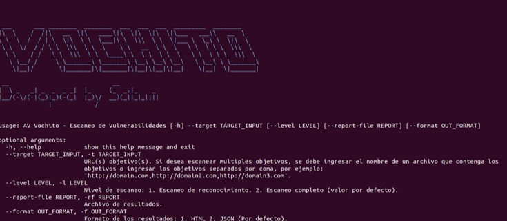

# PRUEBA
## Arachni

Arachni es una herramienta que permite evaluar aplicaciones web y cuenta con un entorno gráfico para facilitar su uso. Detecta vulnerabilidades como inyección
Blind SQL, inyección SQL, Cross-Site Request Forgery, Cross-Site Scripting, etc.[^2]

[^2]: Maguey (S/a) “Herramientas maguey” recuperado el 31 de marzo de 2021 en: https://sourceforge.net/p/magueyv2/wiki/es_Arachni/

### Valores que recibe

Para ejecutar la ayuda es mediante el siguiente comando el cual nos mostrará los valores que recibe.

```
python3 av-scan.py -h
```

<div align="center"></div>

- av-scan
- av-reporter
- Dockerfile
- OpenVas

Opción “- - target” o “-t” es para indicarle la URL objetivo que se quiera escanear, puede recibir una o más URL’s. Estás pueden ser indicadas en un archivo
con extensión “.txt” o las URL’s separadas por una coma. Está opción requiere como mínimo una URL.
